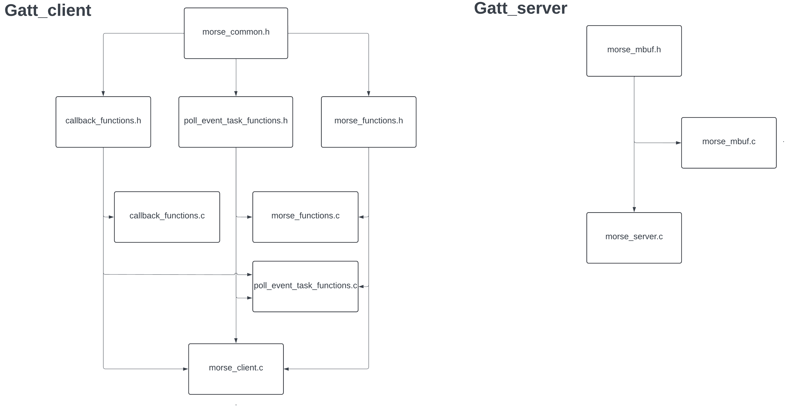

# ESP_MorseCode
## Abstract
This project emulates morse code communication, where one ESP32 board, the client, receives a morse code input from the user and sends it as a Bluetooth Low Energy (BLE) packet to the second ESP32 board, the server.

This is done using two ESP32 development boards and the [ESP-IDF](https://github.com/espressif/esp-idf) IoT development framework as well as the [Apache Mynewt NimBLE](https://mynewt.apache.org/latest/network/index.html) BLE stack.

In our tests, the system is flashed with UART and each board is monitored in a computer terminal window. The server does not require special wiring other than power. The client is wired according to the following image, below:

For more specifics regarding flashing and setup, see the appropriate sections from the table of contents, below.

## Table of Contents

[Setup and Flashing](#Setup-and-Flashing)

[Software Overview](#Software-Overview)

## Introduction

There are two buttons implemented on the GPIO pins of the development board with multiple interrupt service routines (ISRs) to minimize polling and resource utilization. 

Of these two buttons, one is for the writing and encoding of the message and the other is for sending it to the server device. 

The write/encode button functions as normal for morse code communication, where short presses or long presses (dots or dashes) are mapped to 0s and 1s in our code, respectively. As the user provides morse code inputs, 0s and 1s are put into a message buffer for storage. A 2 second interval between inputs marks the finalization of the character for the encoding by placing a 2 into the message buffer (Ex. 00-2-01-2 => IA). Before sending, the message buffer is split at the 2s into groups of 0s and 1s. Each group is converted into characters according to the morse encoding and are placed into a secondary character message buffer which results in a 28% reduction of packet size.

## BLE Structure

Our BLE profile contains a single service, it has a 128-bit UUID as it is not within the BLE specification document for predefined UUIDs. Within that service there is a single characteristic that has read and write permissions for the user. 

If the characteristic is read, it shows the client the previously written value. If there was no value written prior, it defaults to returning the string “Hello World!”. If the characteristic is written to, it takes the user input buffer, prints it out to the server, and saves it to the server for future read events.

## Setup and Flashing

### Hardware Setup

The equipment needed for this project is:
* Two ESP-32 dev boards, with bluetooth capability. We used ESP-32S boards with the ESP-WROOM-32 chip.
* Two button switches for the “fill buffer” and “send buffer” buttons.
* At least 6 Male to Male Dupont cables for connecting GPIO pins, buttons, and dev boards.
* One breadboard or other method of stabilizing the dev boards and connecting GPIO pins and buttons.
* Two Micro USB cables for flashing and monitoring the ESP-32 boards.
* A computer or other device capable of flashing the boards and monitoring terminal outputs.

The client hardware setup, featuring power and the buttons for “fill buffer” and “send buffer” are shown below. Note that power can be provided to the ESP-32 through either the Micro USB 

The server hardware setup only requires power, which can be achieved through the Micro USB cable.

### What to flash and how

Each board must be flashed with the code from their directories, labeled gatt_client and gatt_server respectively. The boards can be flashed using the build and flash tool in the ESP-IDF toolkit. They should immediately pair with one another and begin communication. If issues arise, try resetting the server, then resetting the client in that order. Also note if the client cannot find the server within 10 seconds of initializing the search it must be rebooted.

### Using the buttons

GPIO 4 and 5 are both connected to the “fill_buffer” button, with the two pins responsible for monitoring the press and release of the button.

This button measures the time between press and release events using the real-time clock (RTC) on the development board. The duration of the press is then compared to a global value which is set to one second (1000000 microseconds) by default to decide for a short (0 in buffer) or long press (1 in buffer). Additional inputs are counted towards the current character unless two seconds have elapsed between the last and current input, in which case the current input shall count towards a new character.

Once the message is completed, the “send buffer” button (GPIO 23) can be triggered to encode the message buffer, which fills the character buffer then sends it to the server device.

## Software Overview

Overaall Headerfile Organization can be seen in the image below.

Our software begins by setting up GPIO functions and beginning the BLE connection. Because a whitelist is used our client and server can only connect to each other which would prevent any unwanted changes and interference from an outside user. Next a discovery period begins so the client is able to find the server's advertisement packets and begin connecting. While connecting, all important information such as the connection description, included services and characteristics would be saved into a structure named ble_profile for future events. 

As the connection is occurring our system is listening for GPIO inputs as they use interrupts to save and write data to the morse code buffer. Each of those actions is contained within its own dedicated button.

Shortly after this begins another task is started named “Poll Event” which would check for the read and write flags which would be set with the GPIO buttons. This is done so the ISR would not contain any large or complex functions to minimize overhead and would offload it to this poll event task.

Each device has a corresponding hyperlink with more information on structure below:

* [Gatt_Client](Gatt_client/)

* [Gatt_Server](Gatt_server)

## Known Bugs

List of bugs:
* Stack overflow random crashes (rare)
* Large messages are not property saved to be written 

## Future Works
[BLE controlled STM32Quadcopter](https://github.com/ThaneGallo/Stm32QuadCopter)

