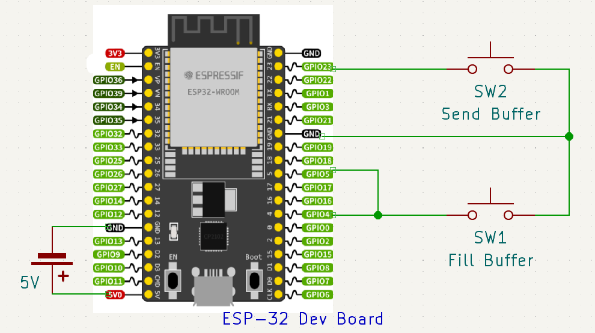

# ESP_MorseCode
## Introduction
This project will be using the an ESP32 development board and the [ESP-IDF](https://github.com/espressif/esp-idf) IoT development framework. It utilizes the Bluetooth Low Energy (BLE) protocol in order to allow for point to point communication through morse code.

There are buttons implimented on the gpio pins of the development board with multiple ISRs to remove any polling and minimize resource utilization. There are two buttons, one for the writing and encoding of the message and the other for sending it to the other device. The message is written as an array of 1s and 0s signifying a long versus short press and each letter is seprated by a longer time without a press which would place a 2 into the array to signify a letter seperation. Then this array is concatinated using the encoding function giving turning each letter to a character to send one value at a time compared to having to send several bytes of data per letter. The GATT profile contains a characteristic for the translated message.  

## How to use

### Hardware Setup

### What to flash and how

There are currently two differnet files to be flashed, one for the client and one for the server. They are in their directories labelled gatt_client and gatt_server respectively. Simply use the flashing tool in the ESP-IDF toolkit and flash each dev board and they should pair with one another and begin communications.

### Using the buttons

GPIO 4 and 5 are both connected to one of the buttons they trigger an interrupt on the negative edge and positive edge of the gpio signal respectively. This button measures the time between events using the RTC on the development board and compares to a global value which is currently set to one second (1000000 microseconds). If the time between events is above one second it fills the message buffer with a 1 and if it is below it is filled with a 0. After a character is written there must be no input for two seconds then the next character can be written.

Once the message is completed use the other button which is tied to GPIO 23 which encodes the message the buffer and saves it to a character buffer to speed up transmission by sending the ecoded bytes going from an average of 3.6 bytes per character to 1 byte which effectively less than one third of the original message size.

## Future Works
